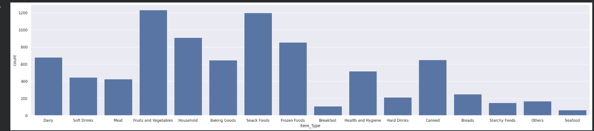
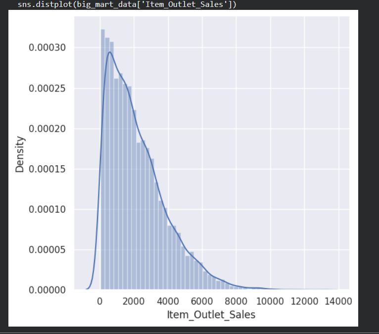

# 🛒 BigMart Sales Prediction using Machine Learning

## 📌 Project Overview

This project focuses on analyzing and predicting product sales for BigMart stores using Machine Learning. The dataset contains information about products, outlet characteristics, and historical sales records. Through data preprocessing, exploratory data analysis, and predictive modeling, the project identifies key factors that influence sales performance and generates accurate sales predictions.

## 🚀 Features

* Data cleaning and preprocessing
* Missing value handling using Mean and Mode imputation
* Exploratory Data Analysis (EDA)
* Sales trend and product analysis
* Feature encoding for machine learning
* Sales prediction using XGBoost Regressor
* Model evaluation using R² Score

## 🛠️ Technologies Used

* Python
* Pandas
* NumPy
* Matplotlib
* Seaborn
* Scikit-Learn
* XGBoost
* KaggleHub

## 📊 Data Analysis

The project includes comprehensive sales analysis and visualization to understand product and outlet performance.

### Item Sales Distribution

Shows the distribution of sales across different products.

### Item Outlet Sales Distribution

Visualizes the overall sales distribution across outlets.

## ⚙️ Machine Learning Workflow

1. Dataset collection from Kaggle using KaggleHub.
2. Data preprocessing and missing value treatment.
3. Exploratory Data Analysis and visualization.
4. Feature encoding using Label Encoding.
5. Train-test data splitting.
6. Model training using XGBoost Regressor.
7. Performance evaluation using R² Score.
8. Sales prediction for BigMart products.

## 📈 Results

The XGBoost model successfully learns patterns from product and outlet characteristics to predict sales with high accuracy. The analysis provides valuable insights into factors affecting product sales and outlet performance.

## 📂 Dataset

BigMart Sales Dataset from Kaggle:
https://www.kaggle.com/datasets/brijbhushannanda1979/bigmart-sales-data
